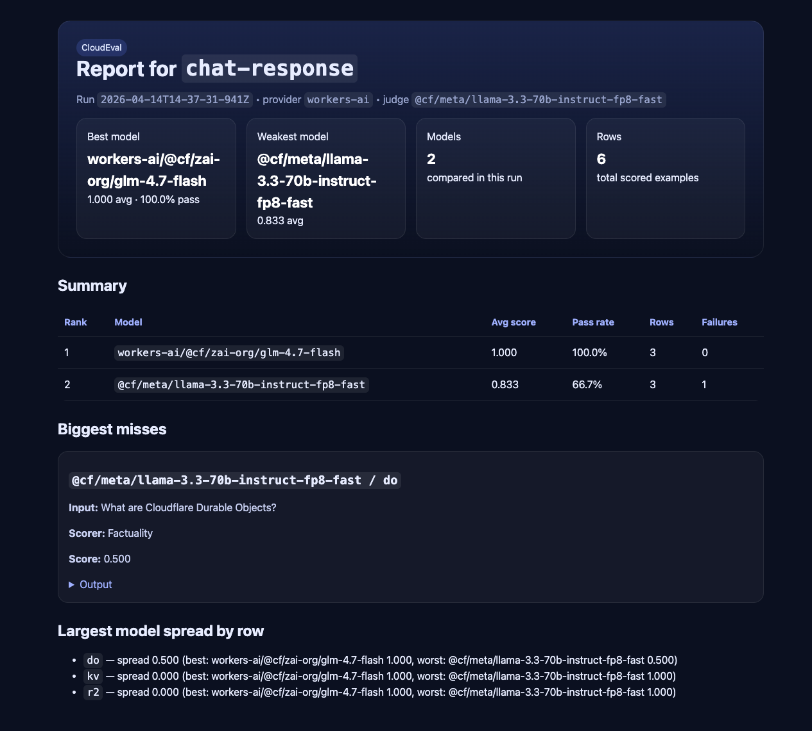

# CloudEval

CloudEval is a CLI for running model evals, comparing models, and generating shareable reports.

It is designed for:
- Cloudflare dogfooding
- public feedback loops
- small, opinionated team evals
- eventually, a broader OSS audience

See also:
- [Getting started](./docs/getting-started.md)
- [Runs and reports](./docs/runs-and-reports.md)
- [Examples](./examples/README.md)

## Why this exists

When you want to compare a model like `workers-ai/@cf/zai-org/glm-4.7-flash` against a baseline, you should be able to:

1. run the same dataset against both models
2. score the outputs consistently
3. generate a report your team can read quickly
4. explain the result in plain English
5. share the run in Braintrust when needed

CloudEval does that.

## Quick start

```bash
git clone https://github.com/acoyfellow/cloudeval.git
cd cloudeval
npm install
cp .env.example .env
source ~/.nvm/nvm.sh && nvm use 22
node ./bin/cloudeval.mjs doctor
node ./bin/cloudeval.mjs run --dataset agent-quality --models workers-ai/@cf/zai-org/glm-4.7-flash,baseline --mock
```

If you already have Node 22 available, you can skip the `nvm` line.

## Preview

The image below is a mock report generated by CloudEval:



## Commands

- `cloudeval doctor` — validate Node, config, and env
- `cloudeval init` — scaffold a starter config and sample datasets
- `cloudeval run` — run an eval locally and write a JSON result
- `cloudeval report` — render a JSON result as markdown
- `cloudeval explain` — turn a JSON result into a plain-English summary
- `cloudeval compare` — compare two result files
- `cloudeval run --braintrust` — generate and execute Braintrust evals

For a deeper walkthrough, start with [docs/getting-started.md](./docs/getting-started.md).

## Example

```bash
node ./bin/cloudeval.mjs run \
  --dataset agent-quality \
  --models workers-ai/@cf/zai-org/glm-4.7-flash,baseline \
  --braintrust
```

That will:
- generate Braintrust eval scripts
- run the task model(s)
- score the outputs
- write a shareable summary to `.cloudeval/braintrust/`

## Local output layout

By default, a local run writes a portable artifact folder under `.cloudeval/runs/`:

```text
.cloudeval/runs/<run-id>-<dataset>-<models>/
  run.json
  report.html
  report.md
  summary.txt
  meta.json
```

`run.json` is the canonical machine-readable file. The HTML report is the easiest thing to open or send around.

For a file-by-file breakdown, see [runs and reports](./docs/runs-and-reports.md).

## Config

CloudEval looks for `evals.config.mjs`.
If it is missing, it falls back to the built-in Cloudflare preset.

Relevant env vars:
- `CLOUDFLARE_ACCOUNT_ID`
- `CLOUDFLARE_API_TOKEN`
- `BRAINTRUST_API_KEY`

## Extending CloudEval

To add a dataset:
1. create a file under `src/datasets/`
2. export `{ name, rows }`
3. reference it from `evals.config.mjs`

To add a scorer:
1. add a rubric in `src/scorers/registry.mjs`
2. wire it into the runner/generator
3. add a test

To add a provider:
1. add an adapter under `src/providers/`
2. keep the provider boundary thin
3. preserve the local/reporting flow

## Architecture

- `src/cli.mjs` — command entrypoint
- `src/runners/` — local eval execution
- `src/report/` — markdown + explanation output
- `src/providers/` — model/provider adapters
- `src/scorers/` — judging logic and rubrics
- `src/braintrust/` — Braintrust script generation
- `src/datasets/` — sample datasets
- `src/presets/` — Cloudflare and generic presets

## Testing

```bash
node --test
```

## License

MIT
